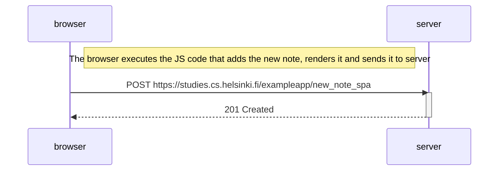

```mermaid
sequenceDiagram
    participant browser
    participant server

	Note right of browser: The browser executes the JS code that adds the new note, renders it and sends it to server

    browser->>server: POST https://studies.cs.helsinki.fi/exampleapp/new_note_spa
    activate server
    server-->>browser: 201 Created
    deactivate server
```
